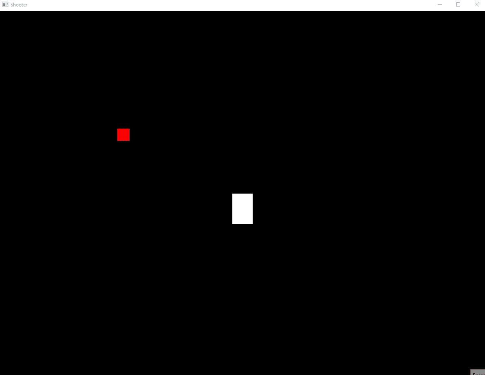
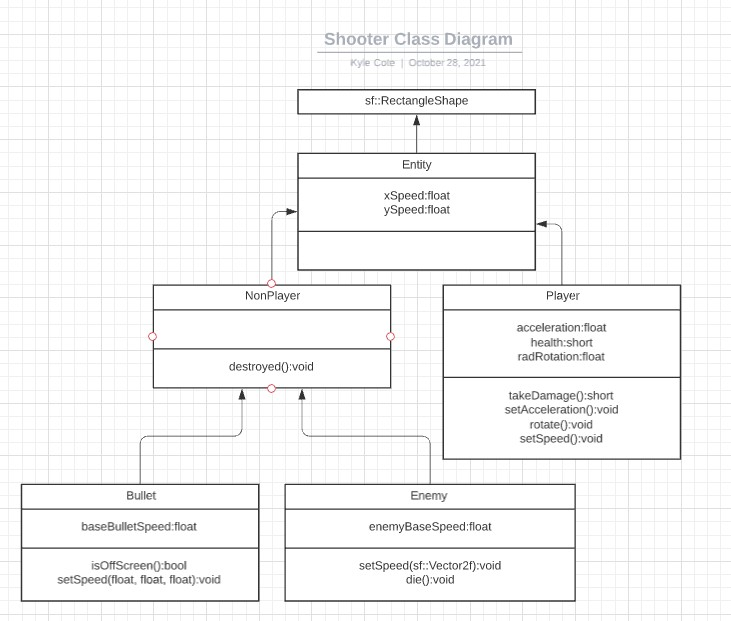

# top-down-space-shooter

This is simply a top down space shooter. I made it when I first started in C++ (that version is viewable as the initial commit) and recently revisited the program to practice OOP and, soon, to add some features I've been thinking about. It was made out of boredom, starting with a DVD logo and slowly advancing as I thought of other stuff to try.  

It is also now going to act as a school project.

## Demonstration

## Diagram

## Getting Started

This project requires SFML 2.5.1 and C++ 14 to run. 
Download link: https://www.sfml-dev.org/download/sfml/2.5.1/
Tutorial for SFML: https://www.sfml-dev.org/tutorials/2.5/start-vc.php

## Built With

* CLion - Initially built on CLion. 
* Visual Studio - Recently moved to Visual Studio
* SFML (Graphics, Window, and System libraries)

## Author

* Kyle Cote

## Acknowledgments

* Professor Paul Allen
* https://www.sfml-dev.org/learn.php

## History

This originated from a class assignment in which we used SFML to generate a blue rectangle. After that, it took the following stages:
* DVD logo (rigged for slightly more corner bounces!)
* Sliding around screen with button presses
* Drifting blue box!
* Top down space shooter

I have been thinking of things I wanted to add to this for some time now. As I now have an understanding of OOP, I am going to be practicing the skills I've gained since creating this, and implementing my new features. 
